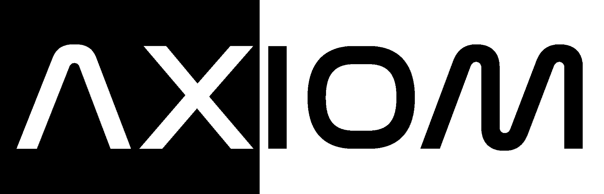

# Welcome to My Page
It's nice to meet you! Thanks for checking this out!

---

## Some Stuff About Me
- I love writing code, I do it all the time.
- My favorite language at the moment is C++
- I'm on the embedded software team in TAMU Robomasters Robotics

---

## I have some cool projects I work on whenever I can!
#### Axiom

Axiom is an operating system that I'm making in my free time. I initially started it to challenge myself
to learn something new and difficult, but that's changed. While it certainly is still challenging at times,
I now do it as a labor of love. It's the project I'm most proud of, no matter how simple it is.
The main idea is to ultimately make a 64-bit unix-like microkernel-based OS that I can use in my day-to-day
development. It's all completely from scratch as well, execpt of course for the bootloader. That is subject
to change however, because I do want to eventually write one. For now though, I'm just focused on getting to
userspace, so I can get some kind of GUI up and running. We're a long way off from that right now, but that's
my ultimate goal at the moment.

#### Dead Pixel

> I don't have a cool logo for this one yet, sorry :P

This is one of my more recent projects. I've been meaning to make it for a long time now, but I just
never got around to making that a reality. Until now. Dead Pixel is a 3D game engine. Well... that's what it
will be, I suppose. As I said, I only started actually doing work on this fairly recently (also recently did a
full re-write too lol). I've been making games since I started programming. It's how I taught myself new subjects
in Computer Science. I'd add them in some sort of game that allowed me to interact with it and really understand
how it works in a practical sense. I want this to be a continuation of that practice. I want to be able to push
this project to the point where I can start participating in things like game jams and maybe even release a game
of my own.

#### aimbots-dev

This is the project that I work on with all the other members of the TAMU Robomasters Embedded Software Team. It
was one of my early adventures into the world of embedded programming (I did robotics in high school and a little
bit of Arduino programming in my Honors Computer Science class as well). I learned an incredible amount about
bare metal programming in just this first year alone. There was a whole world that I never even knew existed.
All these things like CAN, UART, I2C, and PIDs I had never even heard of before, but now I use them almost every
day when I write control code for all the different robots we have. My contributions during the year I've
on team have mainly been in the gimbal control systems, the IST8310 magnetometer driver, and the UART communication code we use
to talk with our CV hardware that controls the aiming of the sentry.
